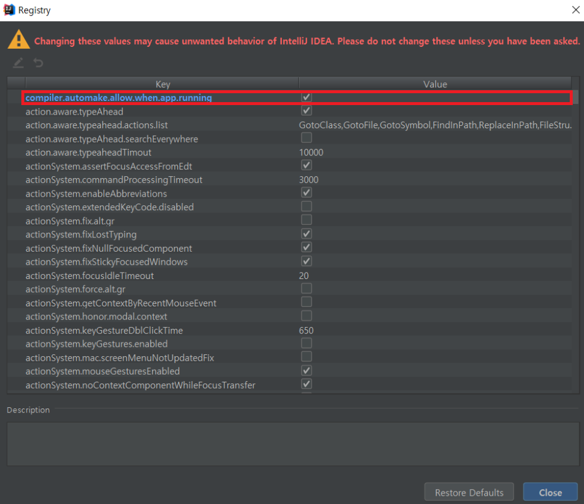

# Open API Specification

PROJECT MO


## YAML관리

다음 프로젝트는 `Swagger + YAML 파일관리`를 통한 OAS 문서관리를 진행하며

`OAS 3.0` 을 기준으로 YAML 파일을 작성합니다. [SWAGGER 바로가기](https://swagger.io/docs/specification/about/)

YAML 파일을 통해 관리하기 위해서는 다양한 양식을 배워야 하기 때문에 러닝커브가 높을 수 있지만

다른 방식(Swagger Annotation, Spring Rest Docs)에 비하여 이를 상쇄하는 다양한 장점이 있습니다.


> 장점

- 작업시간 향상
- 히스토리 관리
- 확장성 증가
  - 프로젝트 종속 제거
  - 프로그래밍 언어 종속 제거
- 다국어처리 용이


YAML 파일을 하나로 관리하는 것은 협업 및 가독성에 좋지 않다고 판단되기 때문에 파일을 분리하여 관리합니다.


> SwaggerAnnotation의 단점

프로젝트에 종속되어 작업을 진행할 수 있으나, 실제 빌드와 연관되어 있지는 않습니다.

작업되는 수 많은 Annotation들은 단지 문서를 작성하기 위한 도구들일 뿐이며 가독성을 떨어뜨릴 수 있습니다.

또한, 프로젝트 및 프로그래밍 언어에 대한 종속은 차 후 발생할 확장성을 방해하는 요소입니다.


## Setting

> [셋팅1] IntelliJ - Swagger PlugIn

IntelliJ를 사용한다면 SwaggerPlugIn을 설치하여 Validation 체크 및 자동 완성 기능을 사용할 수 있습니다. 

[SwaggerPlugIn](https://plugins.jetbrains.com/plugin/8347-swagger) 


> [셋팅2] 정적리소스 서버재구동없이 배포

정적리소스를 서버재구동없이 배포하기 위해 몇 가지 설정을 진행합니다.

1. `Dependency` 

```xml
<dependency>
    <groupId>org.springframework.boot</groupId>
    <artifactId>spring-boot-devtools</artifactId>
    <version>2.1.1.RELEASE</version>
</dependency>
```

2. 검색 > `Registry...` > `compiler.automake.allow.when.app.running` 체크



3. `Setting ` > `Compiler` > `Build project automatically` 체크 


4. `IntelliJ 재시작`


## SpringRestDocs

Spring 진영은 Swagger의 인기에 대응하기 위해 `SpringRestDocs(이하 SRD)`라는 API 명세 작성 방법을 제공합니다.

SRD는 Mock Test 작업만 잘 진행되어 있다면 어느새 API 명세서가 작성되어 있는 것을 볼 수 있습니다.

하지만 위와 마찬가지로 프로젝트 및 프로그래밍 언어에 대한 종속은 확장성을 방해하는 요소입니다.

또한, AsciiDocs라는 낯선 문서작성방법과 별도로 PostMan을 사용해야하는 것은 덤입니다.


## DEPLOY

배포프로세스는 다음과 같습니다.

- -> YAML 문서작업
- -> git pull & conflict check & git push
- -> git webhooking
- -> jenkins build
- -> resource server (or S3)
- -> swagger server (or [petstore_swagger](http://petstore.swagger.io/))


## Swagger-UI

명세서를 제공하는 서버를 둘 것인지 파일로 따로 관리할 것인지는 각자의 영역입니다.

Swagger는 명세서를 제공할 수 있는 서버를 OpenSource로 제공하고 있으며, 

이것을 사용하는 것은 그리 어렵지 않습니다.

따로 파일을 관리하지 않아도 되며, 마이크로서비스의 시대에서 여러 명세서를 한 곳에서 확인할 수 있는 장점이 있습니다.

<u>또한 사용자의 권한에 따라 서버에 인증/인가 체계를 적용할 수도 있을 것입니다. ( 방법아직모름 )</u>

